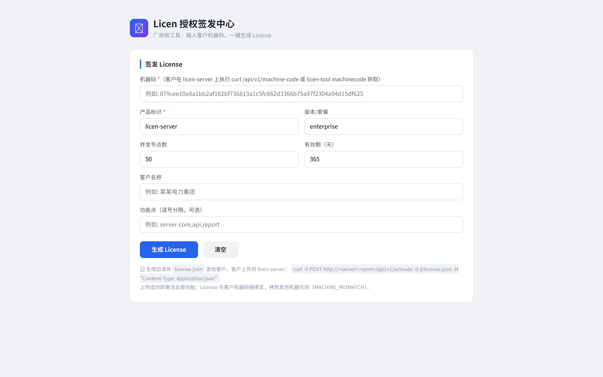
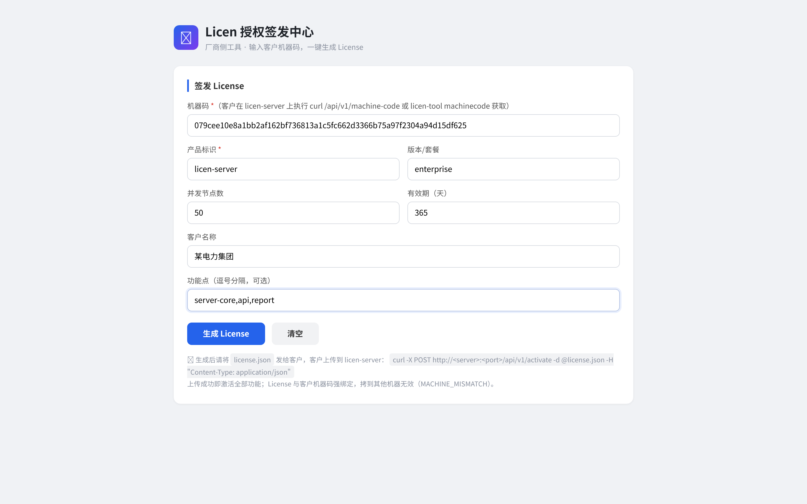
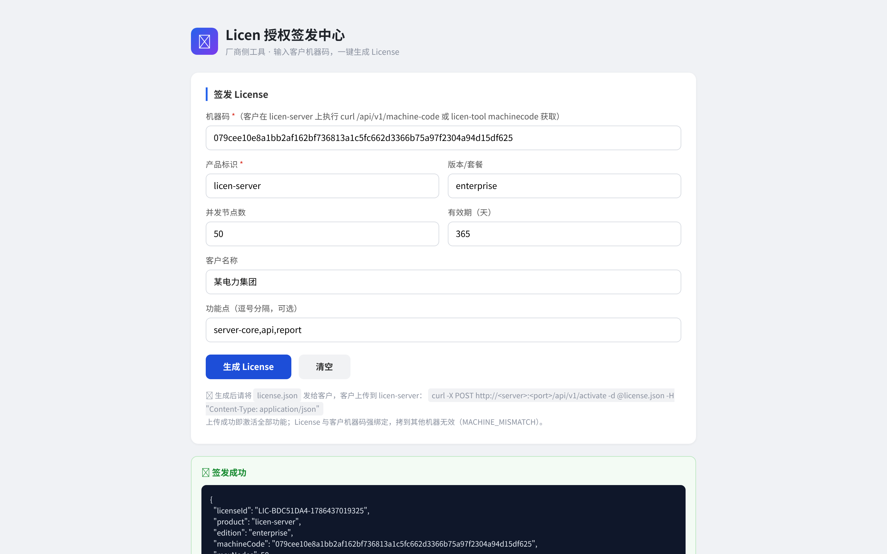
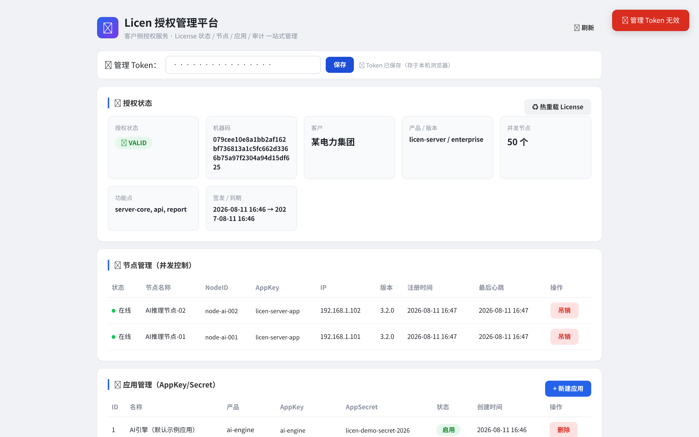
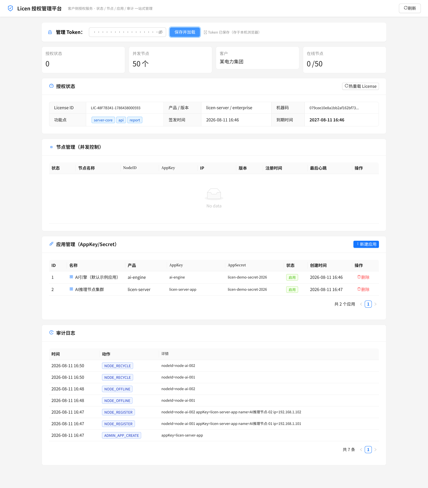
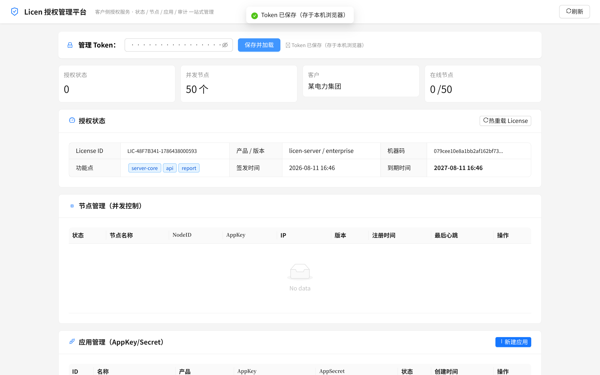
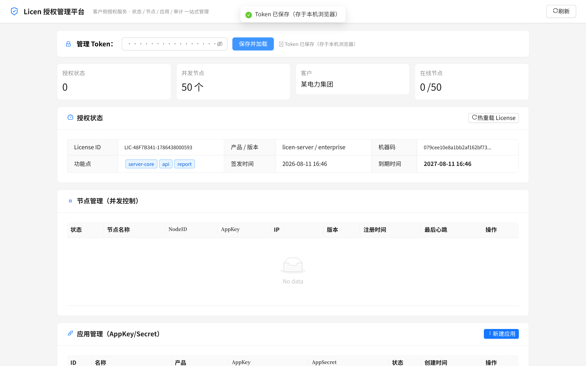

# 🔑 Licen —— 私有化部署产品授权服务

> 为交付到客户现场的私有化软件（AI 引擎、应用服务、边缘网关等）提供**开箱即用的授权管理方案**：
> **先部署后激活**、硬件绑定、节点并发控制、功能点授权、防篡改防逆向，一条龙搞定。

[](https://go.dev)
[](LICENSE)
[](README.md)

---

## ✨ 项目优势

| 维度 | Licen | 传统自研/商业方案 |
|---|---|---|
| **交付体验** | **先部署后激活**：客户先装好系统，机器码发给厂商，一键签发、上传即激活，无需等待 | 一般需现场安装时同步授权，或邮寄加密狗（U 盾），周期长 |
| **部署形态** | `licen-server` 单二进制 + SQLite，**零外部依赖**（不依赖 MySQL/Redis/Nginx），拷到客户 VM 即跑 | 通常要配套数据库、中间件，实施成本高 |
| **防拷贝** | License 绑定**硬件指纹锚点**（系统UUID→磁盘→MAC→主板→CPU 优先级取非空）SHA-256 机器码，加盘/换网卡/调 vCPU/VM 迁移都不变码，整套拷走也跑不起来 | 单纯 License 文件可随意复制 |
| **防篡改** | RSA-2048 私钥签名，改一个字段即 `INVALID_SIGNATURE` | 无签名或弱校验 |
| **防逆向** | Go 静态编译 + 去符号 + **garble 混淆**（每次构建结果不同，防版本比对） | 解释型/字节码易反编译 |
| **并发控制** | License 限定最大并发节点数，心跳保活、超时**自动回收**名额，防僵尸占用 | 无节点级管控 |
| **多语言 SDK** | Java / Go / Python / C **四语言官方 SDK**，统一协议契约，接入 5 分钟 | 通常只有单一语言 SDK |
| **运维便利** | 机器码采集、License 热重载、管理 API、审计日志，Web 签发中心 | 手工改配置、重启服务 |
| **成本** | 纯 Go 开源，无按量计费、无云依赖，可完全离线运行 | 按节点/按年收费的授权网关 |

## 📸 功能截图

### 厂商签发中心（licen-issuer）—— 输入机器码，一键签发

| 签发界面 | 填写客户信息 |
|---|---|
|  |  |

| 签发结果（含 License 全文 + 下载） |
|---|
|  |

### 客户侧授权服务（licen-server）—— 激活后全功能

内置 **Web 管理平台**（`GET /admin`，零依赖单文件），授权状态 / 节点 / 应用 / 审计一站式可视化：

| 管理平台总览（授权状态 + 节点 + 应用 + 审计） | 全页视图（长截图） |
|---|---|
|  |  |

| 授权状态（VALID / 节点数 / 功能点） | 节点管理（并发节点在线） |
|---|---|
|  |  |

## 🎯 应用场景

### 1. 私有化软件交付（最典型）
AI 推理引擎、NLP 平台、数据中台等产品交付到客户内网时，用 Licen 控制"谁能用、用几台、用多久、用哪些功能"。客户不续费 → 到期自动失效，无需上门卸载。

### 2. 边缘网关 / 嵌入式设备
C SDK 支持**纯 socket 零依赖**模式，可嵌入 ARM 边缘网关等受限环境；每台设备一个 License，绑定硬件防刷机盗用。

### 3. SaaS 转私有化
把 SaaS 产品打包交付给大客户私有化部署时，用 Licen 做**订阅管理**：按年授权、按并发节点数计费、按功能点区分标准版/旗舰版。

### 4. 项目型软件（集成商/代理）
集成商代理多套软件时，用 Licen 统一管理所有客户的授权：哪家客户、几个节点、何时到期，Web 签发中心一目了然，不用记文件、查邮件。

### 5. 试用版 / PoC 引流
签发 30 天试用 License 给潜在客户，到期自动停；客户体验满意再买正式版，厂商远程签发续期即可（`/api/v1/activate` 热更新）。

## 架构

```
┌────────────────────────────────────────────────┐
│ 厂商侧（内网）                                   │
│  licen-tool (Go CLI)                           │
│    gen-keypair / gen-license / verify / machinecode │
│  licen-issuer (Web 签发服务)                    │
│    Web UI + REST API：机器码 → license.json     │
│    私钥自留，公钥内置到 licen-server             │
└───────────────┬────────────────────────────────┘
                ▼ License 文件（JSON + RSA 签名，绑定机器码）
┌────────────────────────────────────────────────┐
│ 客户侧（专用 VM）                               │
│  licen-server (Go 单二进制 + SQLite)            │
│    先部署后激活：机器码采集 → 上传 License → 解锁  │
│    验签 → 机器码匹配 → 有效期 → 节点并发控制      │
│    REST API：激活 / 注册 / 心跳 / 状态查询 / 管理 │
└───────────────┬────────────────────────────────┘
                ▲ 注册/心跳（REST + HMAC 签名）
   ┌────────────┼───────────┬───────────┐
 licen-sdk    licen-sdk    licen-sdk   licen-sdk
 -java(已有)   -python      -go         -c
```

## 快速开始（本地全链路）

```bash
# 1. 构建
go build -o licen-server ./cmd/licen-server
go build -o licen-tool ./cmd/licen-tool

# 2. 生成密钥对（私钥厂商自留，公钥内置到服务端）
./licen-tool gen-keypair -d ./keys

# 3. 查看本机机器码（客户 VM 上执行，报给厂商）
./licen-tool machinecode

# 4. 厂商签发 License（绑定机器码、节点数、功能点、有效期）
./licen-tool gen-license -k keys/private.pem \
    -m <机器码> -p ai-engine -n 10 -f ai-inference,nlp -d 365 -c "某公司" -o license.json

# 5. 部署授权服务（客户 VM）：放置 license.json + keys/public.pem + config.yaml
./licen-server -c config.yaml
# 日志出现 "License 加载 result=VALID" 即授权生效

# 6. 验证
curl http://<host>:8090/api/v1/health
curl http://<host>:8090/api/v1/license/status
```

## 先部署后激活（生产模式）

**核心思想**：客户先部署 licen-server（此时**不需要** license.json），只能用基础功能（健康检查/机器码采集/状态查询/激活）。客户把机器码发给厂商，厂商签发 License 后，客户**上传激活**即解锁全部功能（注册/心跳/管理 API）。

```
客户 VM 部署 server（无 license）
   │  curl /api/v1/machine-code → 机器码
   ▼
厂商签发（二选一）
   │  A. CLI:  licen-tool gen-license -k 私钥 -m <机器码> -p licen-server ...
   │  B. 签发服务: licen-issuer Web 界面 / REST API（见下）
   ▼
客户上传激活
   │  curl -X POST http://<host>:8090/api/v1/activate -d @license.json -H "Content-Type: application/json"
   ▼
全部功能解锁（License 与客户机器码强绑定，拷贝无效）
```

**未激活时的 API 行为**：

| API | 未激活 | 激活后 |
|---|---|---|
| `GET /api/v1/health` | ✅ | ✅ |
| `GET /api/v1/machine-code` | ✅ | ✅ |
| `GET /api/v1/license/status` | ✅ | ✅ |
| `POST /api/v1/activate` | ✅（上传激活） | ✅（可换新 License） |
| `POST /api/v1/nodes/register` | 🚫 `LICENSE_NOT_ACTIVATED` | ✅ |
| `POST /api/v1/nodes/heartbeat` | 🚫 | ✅ |
| `/api/v1/admin/*` | 🚫 | ✅ |

**安全保证**：activate 接口不需要管理 Token，但只有**厂商私钥签名 + 绑定本机机器码**的 License 才能激活成功；伪造机器码 → `MACHINE_MISMATCH`，篡改内容 → `INVALID_SIGNATURE`，且激活失败不影响当前已激活状态。

## 厂商签发服务（licen-issuer）—— 统一授权管理台

面向客服/运营的 **Web 签发+管理工具**：输入客户机器码 → 一键生成 license.json 下载回传；**已签发授权全部留痕**（台账），可查看/搜索/吊销/重新签发。

```bash
# 构建
go build -o licen-issuer ./cmd/licen-issuer

# 配置（config.yaml：端口、厂商私钥、签发 Token、台账路径）
#   server.port: 8099
#   issuer.private-key-file: ./keys/private.pem
#   issuer.admin-token: <务必修改>
#   issuer.db-path: ./data/licenses.json   # 已签发台账（默认 data/licenses.json）

# 启动
./licen-issuer -c config.yaml
```

- **Web 界面**：`http://<厂商机>:8099/` —— ①签发表单（机器码/产品/节点数/有效期 → 生成+下载 license.json）②**已签发授权台账**（状态：有效/已过期/已吊销；可按客户/产品/ID 搜索；操作：下载/重新签发/吊销）
- **REST API**（均 `X-Issuer-Token` 鉴权）：
  - `POST /api/v1/issue` 签发（JSON）；`POST /api/v1/issue-text` 兼容表单
  - `GET /api/v1/licenses` 已签发列表（含派生状态）
  - `POST /api/v1/licenses/{id}/revoke` 吊销（记原因，作废标记）
  - `POST /api/v1/licenses/{id}/reissue` 重新签发（原参数续期，旧 License 自动吊销并关联新 ID）
- **台账持久化**：`data/licenses.json`（原子写盘），重启不丢；吊销/重签全程留痕，授权一目了然

```bash
# REST 签发示例
curl -X POST http://<厂商机>:8099/api/v1/issue \
  -H "Content-Type: application/json" -H "X-Issuer-Token: <token>" \
  -d '{"machineCode":"<客户机器码>","product":"licen-server","maxNodes":50,"days":365,"customer":"某集团","features":["server-core","api"]}'
```

> 生产务必：私钥由 `licen-tool gen-keypair` 生成且只放在厂商内网；公钥通过 `-ldflags -X main.publicKey=...` 内置进 licen-server 二进制（防公钥替换）。

## 加固构建（防逆向）

生产发布建议使用加固构建脚本 `scripts/build-release.sh`，产物为**静态链接 + 去符号 + garble 混淆**：

```bash
./scripts/build-release.sh                # 当前平台（linux/amd64）
./scripts/build-release.sh linux amd64    # 交叉构建指定平台
SKIP_GARBLE=1 ./scripts/build-release.sh  # 仅静态+去符号，跳过混淆（构建更快）
```

产物输出到 `dist/<version>/<os>-<arch>/`，包含 `licen-server` / `licen-tool` / `licen-issuer` 三个二进制（均无符号表、函数名/字符串全部混淆，garble `-literals -tiny -seed=random` 每次构建结果不同），外加配置模板与协议文档。构建后脚本自动校验「静态链接」和「符号剥离」两项加固指标。

> 前置条件：Go ≥ 1.26（garble 最新版依赖）、garble（缺失时脚本自动安装）。

## 部署指南（客户 VM）

1. 上传 `licen-server` 二进制、`config.yaml`、`keys/public.pem`（**license.json 可后补**）
2. 修改 `config.yaml`：`admin-token`、端口、心跳超时
3. `./licen-server -c config.yaml`（systemd 托管见 `docs/systemd.md`，可选）
4. 启动后：`curl /api/v1/machine-code` 获取机器码 → 发给厂商
5. 厂商签发（CLI 或 licen-issuer）→ 客户上传激活：
   `curl -X POST http://<host>:8090/api/v1/activate -d @license.json -H "Content-Type: application/json"`
   → 返回 `"success": true` 即全部功能启用
6. 管理端（二选一）：
   - **Web 管理平台**：浏览器打开 `http://<host>:8090/admin`，输入 `admin-token` 即可视化查看/操作（授权状态、License 热重载、节点管理、Apps、审计日志）
   - **REST API**（需请求头 `X-Admin-Token`）：
     - `GET /api/v1/admin/nodes` 节点列表
     - `POST /api/v1/admin/apps` 创建应用（appKey/appSecret 给产品 SDK 用）
     - `POST /api/v1/admin/license/reload` 热加载新 License

## 产品接入（SDK）

| 语言 | 状态 | 说明 |
|---|---|---|
| Java | ✅ 可用 | `licen-sdk/`，Spring Boot Starter，配置 `licen.sdk.*` 即接入 |
| Go | ✅ 可用 | `licen-sdk-go/`，零依赖，`go get` 即用 |
| Python | ✅ 可用 | `licen-sdk-python/`，零依赖，`pip install` |
| C | ✅ 可用 | `licen-sdk-c/`，libcurl + 纯 socket 双模式，适配嵌入式 |

协议契约见 `docs/protocol.md`（唯一事实来源）。

## 目录结构

```
cmd/licen-server/      授权服务主程序（先部署后激活）
cmd/licen-tool/        厂商 CLI 工具
cmd/licen-issuer/      厂商 Web 签发服务（机器码 → license）
internal/config/       配置加载
internal/machine/      机器码采集（Linux sysfs）
internal/license/      License 模型 + RSA 签名/验签/校验/激活
internal/store/        SQLite 存储（节点/应用/审计）
internal/node/         节点注册/心跳/名额控制/回收
internal/api/          REST API（激活门控）
licen-sdk/             Java 客户端 SDK（Spring Boot Starter）
licen-examples/        接入示例
scripts/               加固构建脚本（build-release.sh）
docs/                  设计文档 + 协议契约 + 演示密钥 + 截图
```

## 安全设计

- **RSA-2048**：License 由厂商私钥签名，服务端公钥验签；公钥无法伪造签名
- **机器码绑定**：硬件指纹锚点（系统UUID→磁盘→MAC→主板→CPU 取优先级最高的非空源）→ SHA-256，加盘/换网卡/调 vCPU/VM 迁移不变码，License 无法迁移服务器
- **HMAC 心跳**：appSecret 签名 + 时间戳防重放（±5min），常量时间比较
- **节点名额**：在线节点数 ≥ maxNodes 拒绝注册；心跳超时回收防僵尸占用
- **三层鉴权**：应用凭证（注册）+ HMAC 签名（心跳）+ 管理 Token（管理 API）
- **防逆向**：Go 静态编译（CGO_ENABLED=0）、去符号（-s -w）、garble 混淆（构建脚本见 `scripts/build-release.sh`）

## License

GPL-3.0（开源项目，欢迎共建）
